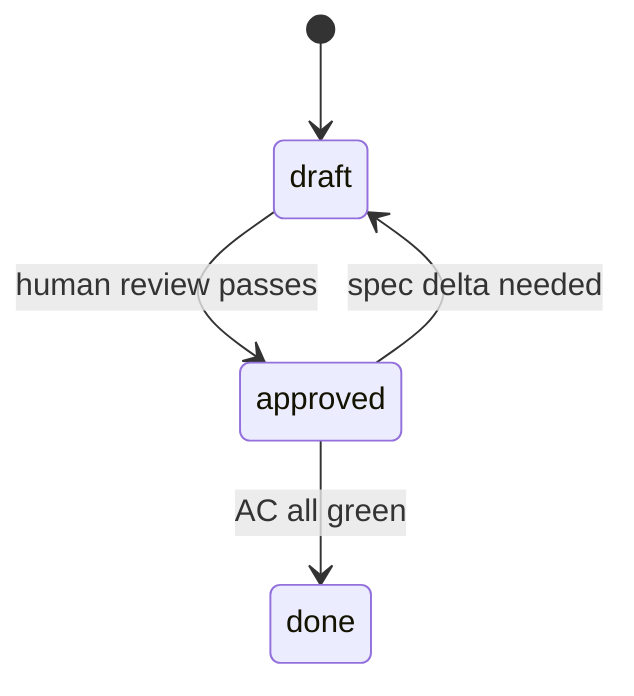

# SDD Workflow Template

> Minimal spec-driven development template for AI-assisted projects.
> Optimized for **Claude Code** and **Codex**.

[](https://github.com/new?template_name=sdd-workflow)
[](#license)

---

## What it gives you

| | |
|---|---|
| 🧭 | A short, stable workflow: `Spec → Approve → Implement → Verify` |
| 📜 | Per-feature specs as the source of truth (Markdown, in-repo) |
| 🪙 | Token-efficient context contract for LLMs |
| 🤖 | Provider bootstraps (`CLAUDE.md`, `AGENTS.md`) the agents auto-load |

## Workflow at a glance




Two gates, that's it:

- **Status gate** — no code until `status: approved`
- **Spec-delta gate** — if implementation reveals a spec gap, stop and propose a spec delta

## Quick start

1. Click **Use this template** → create a new repo
2. Edit `spec/00-constitution.md` — replace `<TODO>` markers (stack, test, lint)
3. Delete the provider file you don't use (`CLAUDE.md` or `AGENTS.md`)
4. Open your agent — it reads the bootstrap, sees `active_feature: null`, asks which feature to start
5. Copy `spec/features/F000-template.md` → `F001-<name>.md`, draft, approve, implement

Full guide: [`docs/quickstart.md`](docs/quickstart.md)

## Layout

```
.
├── CLAUDE.md          # Claude Code bootstrap
├── AGENTS.md          # Codex bootstrap
├── docs/              # User-facing guides
├── spec/
│   ├── 00-constitution.md   # Principles, workflow, gates
│   ├── 01-rules-llm.md      # Provider-agnostic LLM rules
│   ├── STATE.md             # Pointer to the active feature
│   ├── features/F000-template.md
│   └── adr/ADR-000-template.md
└── .github/           # Issue forms + PR template
```

## Docs

| | |
|---|---|
| 🚀 [Quickstart](docs/quickstart.md) | 5-minute setup |
| 📖 [Walkthrough](docs/walkthrough.md) | One feature from spec to done |
| ❓ [FAQ](docs/faq.md) | Design choices, common questions |
| 🔧 [`spec/README.md`](spec/README.md) | In-repo workflow reference |

## License

MIT
