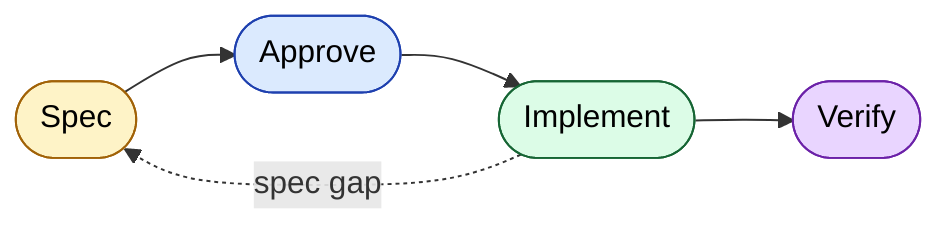
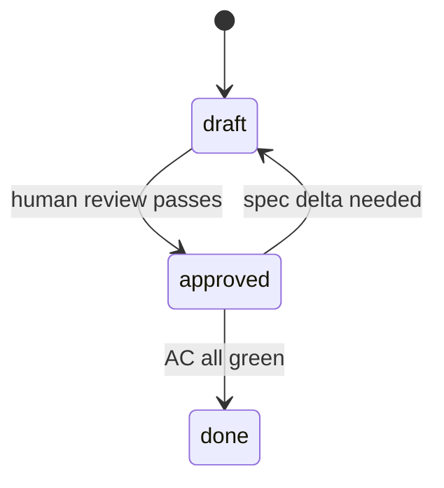

# SDD Workflow Template

> Minimal spec-driven development template for AI-assisted projects.
> Optimized for **Claude Code** and **Codex**.

[](#license)

---

## What is spec-driven development?

You write a short spec **before** the code. The spec defines what's in scope, the contract, the scenarios, and what "done" looks like. The AI implements against the spec. If reality and spec disagree, you fix the spec first. That's it.

## What this template gives you

| | |
|---|---|
| 🧭 | A short workflow: `Spec → Approve → Implement → Verify` |
| 📜 | Per-feature specs as the source of truth — plain Markdown, in your repo |
| 🪙 | A small, fixed context for every LLM call (no token bloat) |
| 🤖 | Provider files (`CLAUDE.md`, `AGENTS.md`) the AI loads automatically |

## Workflow at a glance





Two rules:

- **Status gate** — no code until `status: approved`
- **Spec-delta gate** — if implementation reveals a spec gap, stop and propose a spec delta

## Quick start

1. Click **Use this template** on GitHub → create your repo, clone it
2. Open `spec/00-constitution.md` and fill in your stack (test command, lint command)
3. Keep the provider file your AI uses; delete the other:
   - Claude Code → keep `CLAUDE.md`
   - Codex → keep `AGENTS.md`
4. Open your AI in the repo. It reads the provider file, then `spec/STATE.md`, finds `active_feature: null`, and asks which feature to start
5. Copy `spec/features/F000-template.md` → `F001-<your-feature>.md`
6. Fill in the spec with the AI's help (Intent, Scope, Contracts, Scenarios, AC)
7. Flip `status: approved` → ask the AI to implement → walk the AC checklist → flip `status: done`

Full guide: [`docs/quickstart.md`](docs/quickstart.md). Worked example: [`docs/walkthrough.md`](docs/walkthrough.md).

## Layout

```
.
├── CLAUDE.md          # Claude Code bootstrap
├── AGENTS.md          # Codex bootstrap
├── docs/              # User-facing guides
├── spec/
│   ├── 00-constitution.md   # Project principles, workflow, gates
│   ├── 01-rules-llm.md      # Rules the LLM loads every session
│   ├── STATE.md             # Pointer to the active feature
│   ├── features/F000-template.md
│   └── adr/ADR-000-template.md
└── .github/           # Bug template + PR template
```

## Docs

| | |
|---|---|
| 🚀 [Quickstart](docs/quickstart.md) | 5-minute setup |
| 📖 [Walkthrough](docs/walkthrough.md) | One feature from spec to done |
| ❓ [FAQ](docs/faq.md) | Design choices, common questions |
| ⚡ [Superpowers](docs/superpowers.md) | Using the `superpowers:*` skill pack with SDD |
| 🔧 [`spec/README.md`](spec/README.md) | In-repo workflow reference |

## Related: GitHub Speckit

This template and [GitHub spec-kit](https://github.com/github/spec-kit) (Speckit) solve the same problem differently. SDD here = plain Markdown + frontmatter gates. Speckit = CLI + slash commands (`/specify`, `/plan`, `/tasks`, `/implement`) + `.specify/` scaffold.

Pick one. Don't run both in the same repo — sync drift and decision fatigue cost more than the optionality is worth.

Switching to Speckit: `uvx --from git+https://github.com/github/spec-kit.git specify init --here --ai claude`, then migrate `spec/features/FNNN-*.md` → `specs/NNN-slug/spec.md` and delete `spec/`.

## License

MIT
