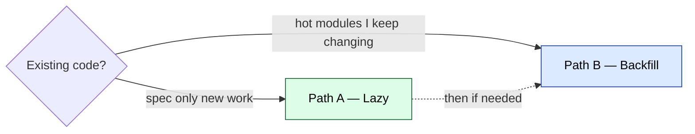

# Migrating an existing project to SDD

> You already have a codebase. You want spec-driven development going forward without rewriting history.

## Pick a path



| Path | When                                  | Cost              |
| ---- | ------------------------------------- | ----------------- |
| A    | Default. Spec only new work.          | ~10 min one-time  |
| B    | Hot modules you keep changing.        | ~30 min / module  |

Full rewrite-with-specs is a third option. Skip it — you won't finish. If the code is bad enough to rewrite, scope it as a new project using Path B, one module at a time.

---

## Path A — Lazy retrofit (recommended)

Existing code stays as-is. Specs apply only to features you write from today onward.

### 1. Copy template files into your repo

```bash
# from your existing project root
git clone --depth=1 https://github.com/mgummich/sdd-workflow.git /tmp/sdd
cp -r /tmp/sdd/spec ./
cp /tmp/sdd/CLAUDE.md ./       # or AGENTS.md for Codex
mkdir -p docs .github/ISSUE_TEMPLATE
cp /tmp/sdd/docs/*.md ./docs/
cp /tmp/sdd/.github/PULL_REQUEST_TEMPLATE.md ./.github/
cp /tmp/sdd/.github/ISSUE_TEMPLATE/bug.md ./.github/ISSUE_TEMPLATE/
rm -rf /tmp/sdd
```

### 2. Merge clashes, don't overwrite

| File you may already have       | Action                                                     |
| ------------------------------- | ---------------------------------------------------------- |
| `CLAUDE.md` / `AGENTS.md`       | Prepend SDD bootstrap to top of yours. Keep your rules.    |
| `.github/PULL_REQUEST_TEMPLATE` | Add "Spec Reference" + AC checklist sections. Keep rest.   |
| `README.md`                     | Add link to `spec/README.md`. Otherwise untouched.         |
| `docs/`                         | Add SDD docs alongside yours.                              |

### 3. Fill the constitution

Edit `spec/00-constitution.md`:

- Stack (language, framework versions)
- Test command (`pnpm test`, `pytest`, `cargo test`, …)
- Lint command
- Type-check command (if applicable)
- Build command

### 4. Reset STATE.md

```yaml
---
active_feature: null
load: []
---
```

### 5. First feature

```bash
cp spec/features/F000-template.md spec/features/F001-<your-feature>.md
```

Follow [`docs/walkthrough.md`](walkthrough.md).

---

## Path B — Backfill critical surfaces

Only for code that keeps changing. Cold code stays uncovered.

### When to backfill

- Module touched >2 PRs per month.
- Public API the rest of the team consumes.
- Compliance-relevant code (auth, billing, data export).

### How

1. Do Path A first.
2. Pick **one** module. Resist scope creep.
3. In the AI session: `Use the spec-miner skill to reverse-engineer spec/features/FNNN-<module>.md from src/<module>/`. (See `fullstack-dev-skills:spec-miner`.)
4. Review the generated spec. Trim to Intent, Contracts, Scenarios, AC that reflect *current* behavior — not aspirational.
5. Set `status: done`. The code already exists; AC describes shipped behavior.
6. Commit the spec.

Next change to that module: flip `status: draft`, edit the spec, flip `status: approved`, implement the delta. Normal SDD loop.

Don't write aspirational specs (improvements = new feature spec, not edits to a `done` one). Don't backfill every file — burnout. Top 3 modules max in week 1. Don't backfill test files; tests verify, they don't spec. Land specs on `main` immediately so they're loadable.

---

## Repo-shape gotchas

### Monorepos

Default: one `spec/` at repo root, features prefixed by package:

```
spec/features/F001-api-rate-limit.md
spec/features/F002-web-checkout-flow.md
```

Per-package `spec/` only when packages ship independently with separate release cycles.

### Polyrepos

One template install per repo. Each repo owns its `spec/`, `STATE.md`, constitution.

### Existing `docs/`

If your `docs/` is product-user-facing, put SDD docs in `docs/dev/` or `.sdd/docs/` instead. Update README links.

### CI

SDD adds no required CI step. Optional hardening, **only after the team uses SDD without coercion**:

- Lint that every PR touching `src/` references a spec file in the PR body.
- Block merge if any `spec/features/F*.md` has `status: draft` and matching code changes.

---

## Migration checklist

```markdown
- [ ] Copied template files (Path A step 1)
- [ ] Merged CLAUDE.md / AGENTS.md without losing existing rules
- [ ] Updated PR template with Spec Reference + AC sections
- [ ] Filled spec/00-constitution.md with real commands
- [ ] STATE.md reset to active_feature: null
- [ ] First F001 spec drafted and approved
- [ ] First F001 implemented end-to-end with the new loop
- [ ] (Optional) Backfilled spec for one hot module (Path B)
- [ ] Team agreement: new work follows SDD; old code untouched
```

---

## When SDD isn't worth it

Skip migration if:

- Project is a one-off script or throwaway prototype.
- Team is solo + short-lived + no AI in the loop.
- Codebase is being sunset.

SDD pays off when: multiple contributors, AI in the loop, code lives >6 months, change pace > 1 PR/week.
