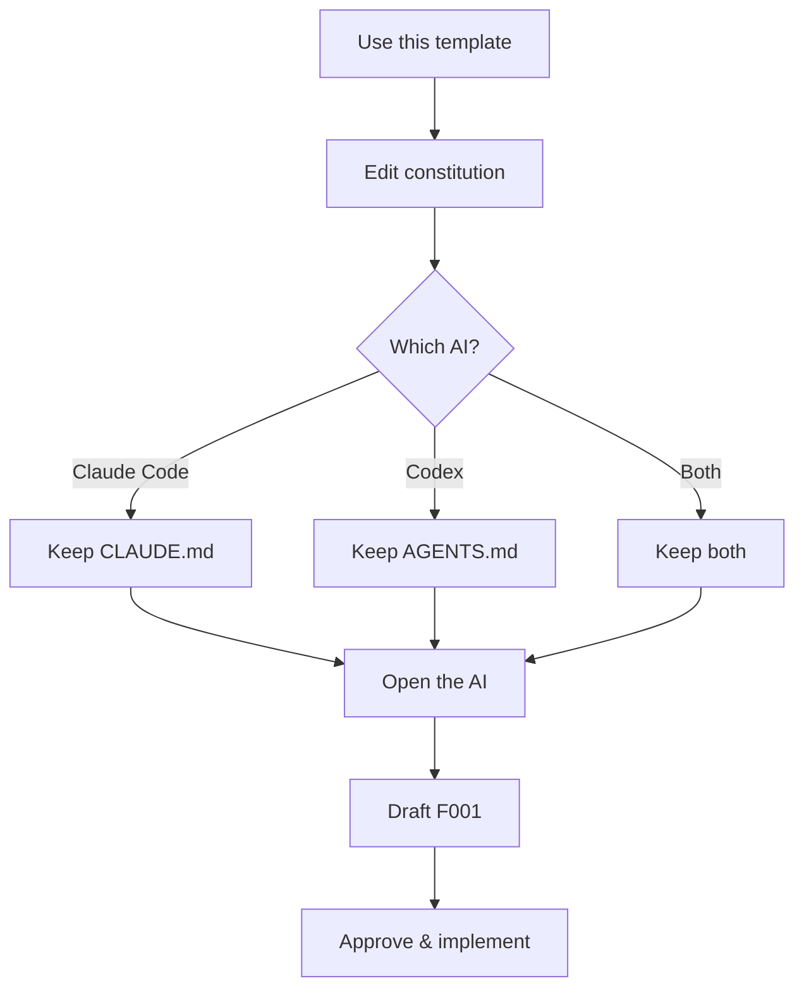

# Quickstart

> 5 minutes from cloning to first approved spec.

## Setup flow



## 1. Create your repo

On GitHub, click **Use this template** on this repo's page. Pick a name, create the repo, clone it locally.

## 2. Fill in your stack

Open `spec/00-constitution.md`. Find the section that looks like this:

```markdown
- **Language/runtime:** `<TODO: tech-stack>`
- **Test command:** `<TODO: test-command>`
- **Lint command:** `<TODO: lint-command>`
- **Pre-commit:** `<TODO: pre-commit-command or n/a>`
```

Replace each `<TODO: ...>` with your project's specifics. For example:

```markdown
- **Language/runtime:** TypeScript / Node 22
- **Test command:** `pnpm test`
- **Lint command:** `pnpm lint`
- **Pre-commit:** `pnpm lint-staged`
```

## 3. Pick your AI

| AI | Keep | Delete |
|---|---|---|
| Claude Code | `CLAUDE.md` | `AGENTS.md` |
| Codex | `AGENTS.md` | `CLAUDE.md` |
| Both | both | — |

## 4. Open your AI in the repo

The AI auto-loads its bootstrap file, then reads `spec/STATE.md`. Since nothing is active yet (`active_feature: null`), it should ask which feature to start. **That's the signal everything is wired up correctly.**

If the AI just starts working without asking, something went wrong — check that the provider file is in the repo root.

## 5. Draft your first feature spec

Copy the template (replace `cp` with whatever your OS uses):

```bash
cp spec/features/F000-template.md spec/features/F001-my-feature.md
```

Open the new file. Edit the frontmatter at the top:

```yaml
id: F001
status: draft              # leave as draft for now
complexity: L1             # L1 = trivial, L2 = normal, L3 = architectural
architectureImpact: false  # true only if it triggers an ADR
```

Then fill in `Intent`, `Scope`, `Business Rules`, `Contracts`, `Scenarios`, `Acceptance Criteria`.

You don't have to write it alone — ask your AI:

> Help me draft the spec for F001 — \<one-sentence description\>.

It will ask clarifying questions and write each section with you.

## 6. Approve and implement

Once the spec reads correctly, flip the status:

```yaml
status: approved
```

Tell the AI to update `spec/STATE.md`, or do it yourself:

```yaml
---
active_feature: F001
load:
  - spec/01-rules-llm.md
  - spec/features/F001-my-feature.md
---
```

Now ask:

> Implement F001.

At the end of each session, the AI appends a `## Progress` entry to the bottom of the feature spec so the next session can pick up where you left off.

## 7. Verify

When the AI says it's done:

1. Open the feature spec
2. Check off every box under `## Acceptance Criteria`
3. Run your test command from `spec/00-constitution.md`
4. If green: ask the AI to append `Verified. AC all green.` to Progress and flip `status: done`

That's the loop. Next feature: copy template → `F002`, repeat.

---

Stuck? [FAQ](faq.md) · Worked example: [walkthrough.md](walkthrough.md)
