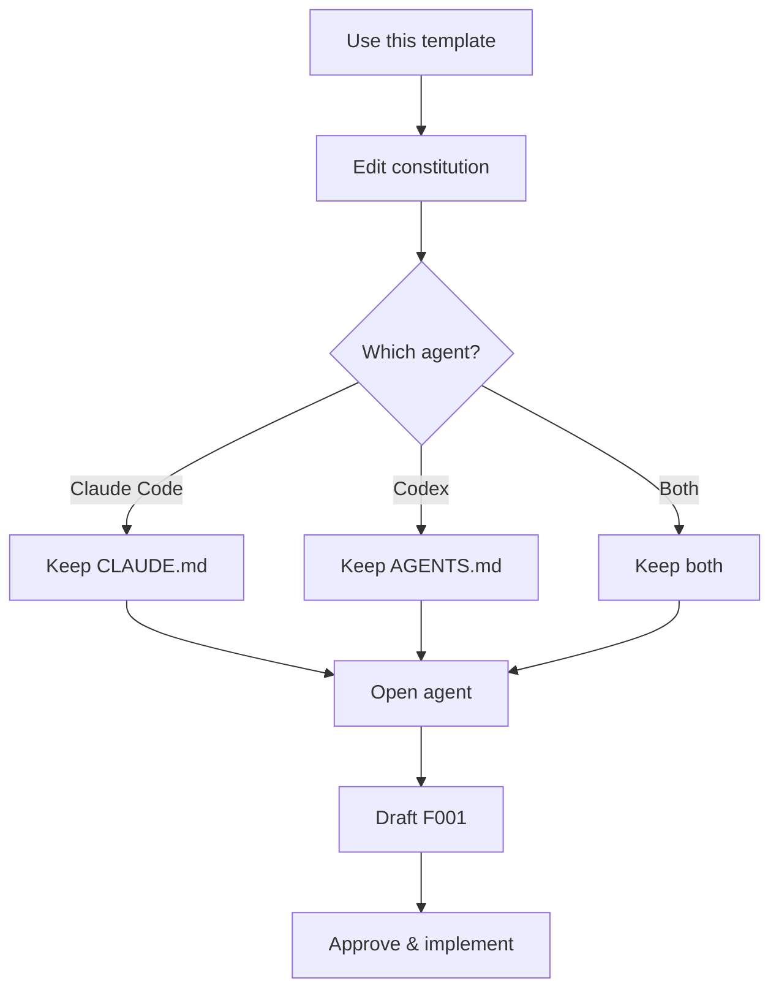

# Quickstart

> 5 minutes from cloning to first approved spec.

## Setup



## 1. Create your repo

Click **Use this template** on GitHub → new repo. Clone.

## 2. Personalize the constitution

Open `spec/00-constitution.md`. Replace `<TODO>` markers in §0:

```markdown
- Language/runtime: TypeScript / Node 22
- Test command: pnpm test
- Lint command: pnpm lint
```

Three lines, that's it.

## 3. Pick your provider

| Agent | Keep | Delete |
|---|---|---|
| Claude Code | `CLAUDE.md` | `AGENTS.md` |
| Codex | `AGENTS.md` | `CLAUDE.md` |
| Both | both | — |

## 4. Open your agent

The agent auto-loads its bootstrap, reads `spec/STATE.md`, sees `active_feature: null`, and asks which feature to start. That's the signal you're set up correctly.

## 5. Draft your first feature spec

```bash
cp spec/features/F000-template.md spec/features/F001-my-feature.md
```

Edit the frontmatter:

```yaml
id: F001
status: draft
complexity: L1
architectureImpact: false
```

Fill `Intent`, `Scope`, `Business Rules`, `Contracts`, `Scenarios`, `Acceptance Criteria`. Ask the agent to help — that's what `draft` status is for.

## 6. Approve and implement

Flip `status: approved`. Update `spec/STATE.md`:

```yaml
---
active_feature: F001
load:
  - spec/01-rules-llm.md
  - spec/features/F001-my-feature.md
---
```

Tell the agent to implement. It appends a `## Progress` entry at end of session.

## 7. Verify

Walk `## Acceptance Criteria`, run tests, append `Verified. AC all green.`, flip `status: done`.

That's the loop. Next feature: copy template → `F002`, repeat.

---

Concrete example: [walkthrough.md](walkthrough.md) · Design choices: [faq.md](faq.md)
