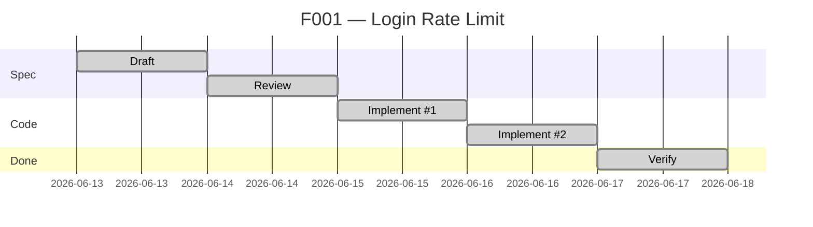
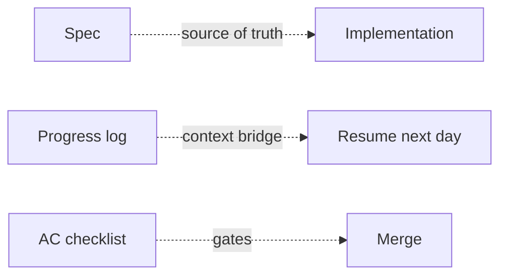

# Walkthrough

> One feature from blank page to `done`. Example: rate-limiting a login endpoint.

## Timeline



---

## Day 1 — Draft

```bash
cp spec/features/F000-template.md spec/features/F001-login-rate-limit.md
```

Frontmatter:

```yaml
id: F001
status: draft
complexity: L2
architectureImpact: false
```

Open Claude Code. It auto-loads `CLAUDE.md`, reads `STATE.md`, finds `active_feature: null`. You say:

> Draft the spec for F001 — rate limit the login endpoint.

Claude asks clarifying questions (window, threshold, response on block, Redis outage behavior). Answers flow into spec sections:

```markdown
## Intent
Limit login attempts per IP to slow credential stuffing. 5/15min.

## Contracts
- POST /login
- 429 over threshold; body `{ "error": "rate_limited", "retry_after": 600 }`
- Header `Retry-After: 600` on 429
- Redis key `login_rl:{ip}`, TTL 900s

## Scenarios
1. Under threshold — 5th attempt returns 200/401
2. At threshold — 6th attempt returns 429
3. After window — counter resets
4. Redis outage — fail open, log warning

## Acceptance Criteria
- [ ] 6th attempt returns 429 with Retry-After
- [ ] Counter expires at TTL
- [ ] Redis outage does not block logins
- [ ] Tests cover all 4 scenarios
```

## Day 2 — Review & approve

Ask Claude:

> Review this spec — edge cases I missed, contracts not fully defined.

It surfaces: IPv6 prefix? Logged-in users limited?

You decide: IPv6 /64 prefix; logged-in users not limited. Add to spec. Set `status: approved`.

Update `spec/STATE.md`:

```yaml
---
active_feature: F001
load:
  - spec/01-rules-llm.md
  - spec/features/F001-login-rate-limit.md
---
```

## Day 3 — Implement (session 1)

> Implement F001.

Claude writes tests first, then middleware, wires into route. End of session:

```markdown
## Progress

**2026-06-15**
- Done: Tests for all 4 scenarios; middleware in src/middleware/rate-limit.ts
- Files: src/middleware/rate-limit.ts, tests/rate-limit.test.ts, src/routes/login.ts
- Decision: Used existing Redis client; no new deps
- Next: IPv6 /64 prefix logic
```

## Day 4 — Implement (session 2)

Next day. Open Claude. It reads STATE → loads spec → sees Progress → knows where to resume.

> Continue F001.

Claude implements IPv6 prefix logic. Tests pass.

```markdown
**2026-06-16**
- Done: IPv6 /64 prefix collapsing in getClientKey()
- Files: src/middleware/rate-limit.ts
- Next: Verify
```

## Day 5 — Verify

> Verify F001.

Claude walks AC, runs `pnpm test`, captures green output:

```markdown
**2026-06-17**
- Done: Verified. AC all green.
```

Flip `status: done`. Reset STATE:

```yaml
---
active_feature: null
load: []
---
```

Commit, push, open PR. PR template links the spec; AC checklist becomes the review checklist.

---

## What happened



- Spec drove implementation; nothing diverged.
- Context survived the Day 3 → Day 4 gap via STATE + Progress.
- One sticky decision (Redis client reuse) captured in Progress, not lost in chat.
- AC drove tests, tests gated merge.

Next feature: copy template → F002. Same loop.
