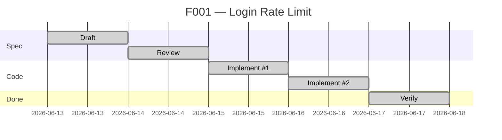
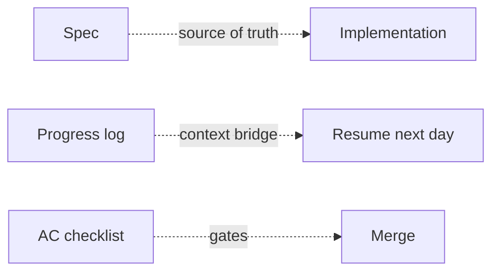

# Walkthrough

> One feature from blank page to `done`. Example: rate-limiting a login endpoint to slow brute-force attacks.

## Timeline



---

## Day 1 — Draft the spec

Copy the template:

```bash
cp spec/features/F000-template.md spec/features/F001-login-rate-limit.md
```

Set the frontmatter:

```yaml
id: F001
status: draft
complexity: L2
architectureImpact: false
```

Open Claude Code. It auto-loads `CLAUDE.md`, reads `STATE.md`, finds `active_feature: null`. You say:

> Draft the spec for F001 — rate-limit the login endpoint to slow credential stuffing.

Claude asks four clarifying questions:

- **Window and threshold?** → 5 attempts per 15-minute window per IP
- **What does the API return when blocked?** → HTTP 429 with a JSON body and a `Retry-After` header
- **Where is the counter stored?** → Redis (already a dependency)
- **What if Redis is down?** → Fail open (let the request through), log a warning

Answers flow into the spec:

```markdown
## Intent
Limit login attempts per IP to slow credential stuffing.
Threshold: 5 attempts per 15-minute window.

## Contracts
- POST /login
- 429 response when over threshold; body `{ "error": "rate_limited", "retry_after": 600 }`
- Header `Retry-After: 600` on 429
- Counter stored in Redis, key `login_rl:{ip}`, TTL 900s

## Scenarios
1. Under threshold — 5th attempt returns 200/401 as normal
2. At threshold — 6th attempt within window returns 429
3. After window — counter resets; logins resume normally
4. Redis outage — middleware fails open (200/401 as normal), logs warning

## Acceptance Criteria
- [ ] 6th attempt returns 429 with Retry-After header
- [ ] Counter expires at TTL
- [ ] Redis outage does not block logins
- [ ] Tests cover all 4 scenarios
```

## Day 2 — Review and approve

Ask Claude:

> Review this spec — edge cases I missed, contracts not fully defined.

It surfaces two gaps:

- **IPv6**: should we use the full address or a `/64` prefix?
- **Logged-in users**: are they limited too, or only the login endpoint?

You decide: use `/64` for IPv6, and only the unauthenticated `POST /login` is limited. Add both to the spec.

Flip the status:

```yaml
status: approved
```

Update `spec/STATE.md`:

```yaml
---
active_feature: F001
load:
  - spec/01-rules-llm.md
  - spec/features/F001-login-rate-limit.md
---
```

## Day 3 — Implement (session 1)

> Implement F001.

Claude writes the tests first (one per scenario), then the middleware, then wires it into the login route. At the end of the session, it appends:

```markdown
## Progress

**2026-06-15**
- Done: Tests for all 4 scenarios; middleware in src/middleware/rate-limit.ts
- Files: src/middleware/rate-limit.ts, tests/rate-limit.test.ts, src/routes/login.ts
- Decision: Used existing Redis client; no new deps
- Next: IPv6 /64 prefix logic
```

## Day 4 — Implement (session 2)

Next day, fresh context. You open Claude. It reads `STATE.md` → loads `F001-login-rate-limit.md` → sees the Progress log → knows the IPv6 work is what's left.

> Continue F001.

Claude implements the `/64` prefix logic in `getClientKey()`. Tests pass.

```markdown
**2026-06-16**
- Done: IPv6 /64 prefix collapsing in getClientKey()
- Files: src/middleware/rate-limit.ts
- Next: Verify
```

## Day 5 — Verify

> Verify F001.

Claude walks the AC checklist, runs `pnpm test`, captures the green output, and appends the final entry:

```markdown
**2026-06-17**
- Done: Verified. AC all green.
```

Flip `status: done`. Reset `STATE.md`:

```yaml
---
active_feature: null
load: []
---
```

## The PR

You commit and push. The PR template auto-fills:

```markdown
## Spec Reference
- Feature spec: `spec/features/F001-login-rate-limit.md`
- Closes issue: #42

## Acceptance Criteria
- [x] 6th attempt returns 429 with Retry-After header
- [x] Counter expires at TTL
- [x] Redis outage does not block logins
- [x] Tests cover all 4 scenarios

## Reviewer checklist
- [x] Spec linked and `status: approved`
- [x] All AC boxes checked
- [x] Tests cover every scenario
- [x] No new secrets / unvalidated inputs
```

The reviewer reads the spec, scans the diff against the AC, approves.

---

## What happened



- The **spec** drove the implementation. Nothing diverged because nothing was guessed.
- The **Progress log** carried context across the Day 3 → Day 4 gap. No "where were we?" at session start.
- One sticky **decision** (reuse the existing Redis client) lives in Progress, not lost in chat history.
- **AC** drove the tests; tests gated the merge.

Next feature: copy the template → `F002`. Same loop.
